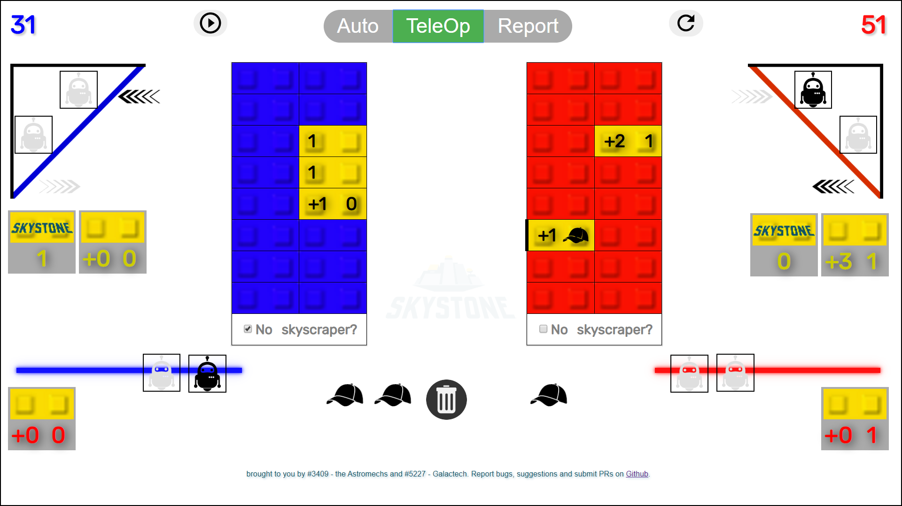
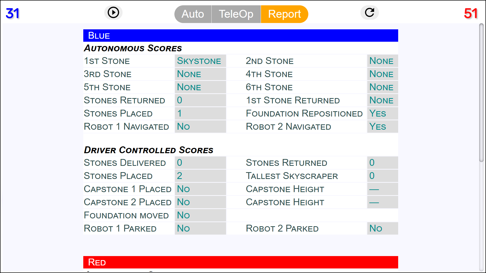

# Skystone Scorer
Scorer / Timer webapp for the FTC Skystone game

[Run directly from this repo](https://raw.githack.com/KCAstromechs/Skystone_Scorer/master/index.htm)

# Usage

You can use this scorer in two ways:
1) **Score calculator** for after-the-fact scoring or strategic planning tool.
   * Use the `Auto` and `TeleOp` buttons to switch between the block placement modes.  The count values preceeded by a plus sign indicate they get the autonomous bonus scores.
   * All parking, platform moving, and other tasks can be toggled freely

2) **Live match scorer** with built in timer
   * Click the  button to start the match.
   * Scoring elements are only available to click at the appropriate times.  (E.g. you can't score endgame parking until the last 30 seconds).  Projected final score is displayed at all times.
   * After the match completes all scoring elements can be adjusted to obtain final score.

There is also a **Report** view which shows the scoring in ways that match the official
FTC scoring system.

## NOTE

The scorer assumes the first returned autonomous stone is a Skystone if there
are any Skystones delivered.  This causes two potential problems in autonomous:
* If a Skystone is scored, then a regular stone is delivered and returned.
  You can score this correctly by simply removing the stone using the trashcan,
  although the Report will be inaccurate.
* No Skystone/stone is scored, but one is returned without being delivered.
  This is a very rare case that only happens if they are taken to the other
  side via the neutral skybridge before being returned.  This would result in
  a net of -10 (for skystone in auto) -2 (for stone in auto) or -1 (for stone in
  teleop) and cannot be directly scored properly.

## Potential ideas
* Possibly a single-side mode
* Possibility of recording stone orientation when stacking
* Help button, leads to popup explaining usage.
